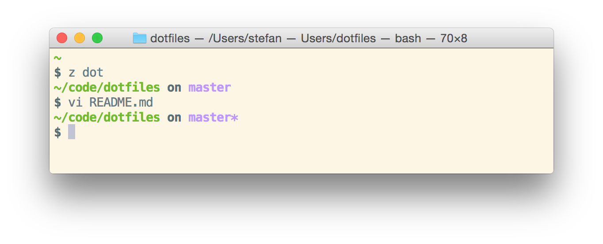
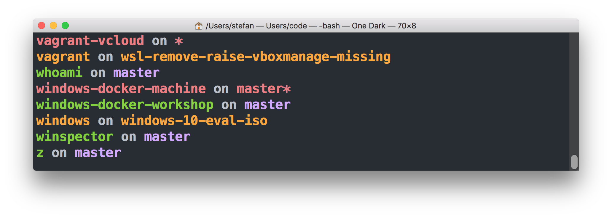

# dotfiles

Add some tweaks into current Unix/Ubuntu user's home directory.
Inspired by <https://github.com/paulirish/dotfiles> for MacOS.
For Windows I prefer my <https://github.com/StefanScherer/dotfiles-windows>.

This is what the terminal looks like



# Installation
    git clone https://github.com/StefanScherer/dotfiles && cd dotfiles && ./sync.sh

To update later on, just run the sync.sh again.

The usage of sync.sh is

```
sync.sh [--all|-a] [--force|-f]

--all|-a     install all tools, also YouCompleteMe (big dependencies)
--force|-f   force overwriting files in $HOME
```

### Tools

* **addtime**: show relative time stamp in stdout of another tool.
  Usage: anothertool | addtime
* **timeref**: show relative time diffs in logfile.
  Usage: timeref logfile | gvim -
* **syncfork**: fetch from upstream and merge master branch
* **fix_github_https_repo**: switch a cloned repo from https to ssh
* **vagrantd**: run vagrant in debug mode, live measure times in console, while capturing debug in logfile
* **z**: "z foo" - cd to most frecent dir matching foo

### Aliases

* **..**: one dir up
* **...**: two dirs up
* **....**: three dirs up
* **.....**: four dirs up
* **~**: go into users home directory
* **fuck**: repeat last command with `sudo` ;-)
* **gi**: create `.gitignore` file, see [gitignore.io](https://gitignore.io)
* **gitcloneall**: clone all repos of an organization or user
  ```
  Usage: gitcloneall git@github.com:YOUR_ORG [user[:pass]]
  Clones all repos of a GitHub org or user.

  gitcloneall git@github.com:StefanScherer
  gitcloneall git@github.com:myorg myuser:password_to_access_private_repos
  ```
* **gitall**: start a git command for all sub directories
  ```
  gitall pull

  vi \*/README.md

  gitall add README.md
  gitall commit -m "updated README.md"
  gitall push
  ```
* **gitls**: show git status of all repos in current dir, you may add args like in `ls` to filter dirs
  
* **git undo-commit**: undo last commit, as it says
* **hosts**: edit your hosts file
* **logvi logfile**: view a log file with relative times in gvim
* **solarize**: change between **dark** and **light** in terminal

### Atom

My preferences for Atom.io are also stored here.

* **autocomplete-plus** - `keymap.cson` use ENTER instead of TAB
* **editorconfig**
* **language-batch**
* **language-powershell**

To setup Atom from scratch, first install it, then
```bash
brew cask install atom
apm install parcel
```
Then open Atom and use menu `Packages / Parcel / Sync` to install all other plugins.

### Sublime Text 3

My preferences for Sublime Text 3 are also stored in the repo. Be aware.
To have sublime in command line, I use my helper script `subl`
The following packages will be installed by Package Control

* **ApplySyntax**
* **Cucumber**
* **EditorConfig**
* **GoSublime**
* **Markdown Preview**
* **PowerShell**
* **Solarized Color Scheme**
* **Solarized Toggle**


### Sublime commands

* `alt+m` open markdown file in browser

### VIM

* installs **Vundle** and some other stuff
* **EditorConfig**
* **vim-colors-solarized**

### VIM commands

* `,c`: show trailing white space
* `,ss`: strip trailing white space
* `,e`: format JavaScript code with esformatter (`npm install -g esformatter`)

# Licensing
Copyright (c) 2014 Stefan Scherer

MIT License, see LICENSE.txt for more details.
